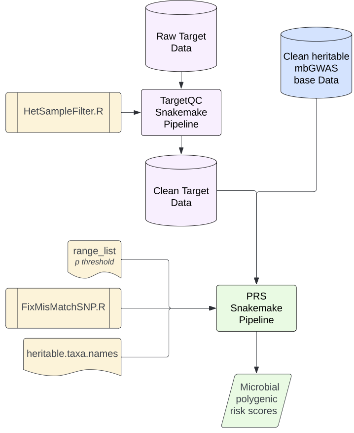

# PolygenicRiskScore
Snakemake pipelines for GWAS target data quality control and polygenic risk score calculation of the CAN-BIND GWAS dataset is provided in this repository. 

The uploaded Snakefiles do not have access to any restricted access datasets and will not run in their current form. Input and output file path should be updated for application to other datasets.

Snakemake is a workflow management system designed for bioinformatics analyses. Installation documentation is available at the following [link](https://snakemake.readthedocs.io/en/stable/index.html).

## Pipeline Overview

**Orange** = Accessory files
**Pink** = Target data
**Blue** = Base data
**Green** = Polygenic Risk Score

First use the TargetQC snakemake pipeline to peform GWAS quality control steps on raw target genome data. The TargetQC snakefile requires HetSampleFilter.R script to run sucessfully, and will output the clean target data. 

> **Warning**
> Failure to run TargetQC pipeline may cause PRS pipeline mismatch repair R scripts to fail. 

Next, input the clean heritable mbGWAS base data summary statistics (provided separately) and clean target genome data to the PRS snakemake pipeline. The PRS snakefile requires the range_list text file and FixMisMatchSNP.R script to run successfully. The range_list file states the p-value threshold used to filter which SNPs are used to calculate the microbial PRS. Currently, the p-value threshold is arbritarily set to discovery threshold of 0.1, however future pipeline iterations that use PRSice2 or other methods to select the optimal p-value threhsold may change this. The PRS snakefile will output sample polygenic risk scores in a file containig the microbial taxon name and .PRS0.1.profile suffix. 

## Required Data, Files, and Dependencies

### Dependencies
- [ ] Snakemake
- [ ] PLINK
- [ ] R

### Data
- [ ] Raw target genome data in PLINK bim/bed/fam format
- [ ] Cleaned base data summary statistics stored as compressed text files (.txt.gz) _(i.e. quality-controlled heritable taxa summary statistics from Kurilshikov mbGWAS)__

### TargetQC Pipline Files
- [ ] TargetQC Pipeline Snakefile
- [ ] HetSampleFilter R script

### PRS Pipline Files
- [ ] PRS Pipeline Snakefile
- [ ] FixMisMatchSNP R script
- [ ] range_list text file

## TargetQC Pipeline Instructions

## 

